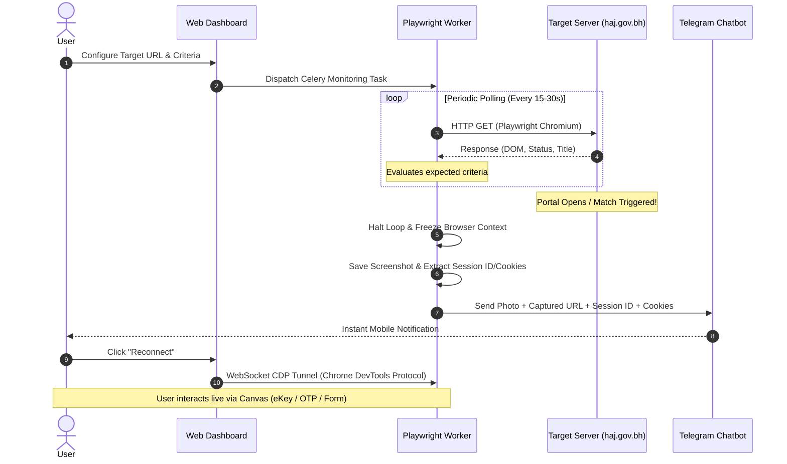

# Session Reserve — Complete Operational Guide & Strategy

This guide explains how **Session Reserve** monitors target portals, detects opening conditions, preserves live authenticated sessions, and gives you the fastest possible reaction time on launch day.

---

## 1. Understanding "Session Priority": Reality vs. Technical Advantage

> [!IMPORTANT]
> **A client-side tool cannot force a remote server to give it server-side priority.**
> Remote web servers (like Nginx and Oracle REST Data Services) process connections on a **First-Come, First-Served (FIFO)** basis or through connection pool queues. No HTTP header, parameter, or bot script can force a government database to jump ahead of other incoming requests.

### Where Your Real Competitive Advantage Comes From

Instead of "jumping queues", Session Reserve gives you an edge by eliminating human latency:

1. **Sub-Second Detection**: While human users manually refresh or wait for social media announcements, the automated worker detects DOM changes within seconds of the portal opening.
2. **Pre-Warmed Browser Profile**: The Chromium profile keeps static assets (CSS, JS bundles, fonts) pre-cached in memory and disk, reducing data transfer when the server is strained.
3. **Session Preservation via CDP**: The browser is already situated on the page. It freezes in an active state, meaning you reconnect directly to the open page without having to re-navigate from scratch.
4. **Immediate Telegram Alerting**: You receive an instant alert on your phone with the live session link, session ID, and page screenshot.

---

## 2. End-to-End System Flow



---

## 3. Step-by-Step Usage Guide

### Step 1: Configure Your Telegram Chatbot

1. Open your Telegram app and message [@BotFather](https://t.me/BotFather) to create a new bot:
   * Send `/newbot` and follow the prompts.
   * Copy the generated **HTTP API Token** (e.g. `123456789:ABCdefGhI...`).
2. Get your personal **Chat ID**:
   * Message [@userinfobot](https://t.me/userinfobot) on Telegram to get your numeric ID (e.g. `987654321`).
   * Start a chat with your newly created bot by clicking **Start**.
3. In Session Reserve:
   * Navigate to **Settings > Telegram Bot Notifications**.
   * Toggle **Enabled**, enter your **Bot Token** and **Chat ID**.
   * Click **Test Telegram Chatbot** to confirm your bot delivers a test message.
   * Click **Save Settings**.

---

### Step 2: Configure the Monitoring Job

In the **Dashboard**, click **New Monitoring Job**:

| Field | Recommended Value | Why |
| :--- | :--- | :--- |
| **Job Name** | `Hajj Platform Registration` | Descriptive label for logs and notifications. |
| **Target URL** | `https://haj.gov.bh/ords/r/haj/hajj_platform/home` | Do **not** use an expired session ID (`?session=...`) because Oracle APEX redirects invalid sessions and issues a new dynamic one. |
| **Check Interval** | `15` to `30` seconds | Frequencies below 10 seconds risk triggering Nginx/WAF rate limiting (`HTTP 429` / IP bans). |
| **Max Retries** | `100` (or higher) | Keeps monitoring running continuously until the portal opens. |
| **Page Timeout** | `30` seconds | Allows sufficient time for heavy server responses under load. |

#### Match Criteria (Choose the most specific condition):

* **Expected Text**: Specific text that only appears when registration goes live (e.g., `بدء التسجيل` or `التسجيل متاح`).
* **Expected Element**: CSS selector of the active registration button (e.g., `button.t-Button--hot`, `#btn_register`, or `a[href*="register"]`).
* **Expected Title**: `منصة الحج` (matches the verified page `<title>`).
* **Expected HTTP Response**: `200`.

Click **Save Job**, then click **Monitor** to start the worker.

---

### Step 3: Automated Detection & Browser Freezing

Once started, the background Celery worker handles everything:

1. **Persistent Context**: Launches Chromium with a persistent user profile (`/app/shared/browser-profiles/user_<id>`).
2. **Evaluation**: Navigates to the portal at your configured interval and evaluates the DOM against your criteria.
3. **The Freeze**: As soon as the condition is satisfied:
   * The worker **does not close or navigate away**.
   * It enters a persistent **hold loop**, keeping the Chromium browser window open and active in memory.
   * It saves a full-page screenshot (`screenshot_job_<id>_<timestamp>.png`).
   * It parses `page.url` to extract the dynamically assigned Oracle APEX session parameter (`?session=...`).
   * It extracts active authentication cookies (including `ORA_WWV_APP_...`).

---

### Step 4: Reviewing the Telegram Alert

Within 1–2 seconds of detection, your Telegram bot sends:

```text
[Attached Screenshot of the active authenticated page]

🚨 SUCCESS: Session Caught & Reserved! 🚨

📋 Job: Hajj Platform Registration
🌐 Initial Target: https://haj.gov.bh/ords/r/haj/hajj_platform/home

🎯 Captured Session URL:
https://haj.gov.bh/ords/r/haj/hajj_platform/home?session=16731417367592

🔑 Session ID: 16731417367592

🍪 Session Cookies:
ORA_WWV_APP_200=ORA_WWV-ATzdNHHQIi7dZy2vFg3nZt9K...

📊 Status: All expected targets matched
⏰ Time: 2026-09-14 01:20:00 UTC

👉 Live browser session is reserved and running. Reconnect anytime via your Dashboard!
```

> [!TIP]
> You can tap the **Session ID** directly on Telegram to copy it with a single tap.

---

### Step 5: Live Interactive Reconnection (CDP Canvas)

1. Open your **Session Reserve Dashboard**.
2. Locate the job in the **Monitoring Engines** table — its badge will show **Success (Reserved)** in green.
3. Click the green **Reconnect** button:
   * A full-screen interactive canvas appears.
   * This is a live, low-latency video stream directly into the worker's Chromium instance via the **Chrome DevTools Protocol (CDP)**.
   * Clicking on the canvas transmits native mouse clicks at exact coordinates.
   * Typing transmits native keystrokes directly into the page.
4. Complete your **eKey login / SMS OTP verification** directly on the canvas without refreshing or losing the captured session state.

---

## 4. Launch Day Best Practices Checklist

- [ ] **Test eKey Login in Advance**: Log in to another Bahrain government portal (e.g. `bahrain.bh`) beforehand to verify that your national ID, password, and SMS OTP phone number are functioning.
- [ ] **Keep Credentials Ready**: Save Civil ID numbers, passport details, and applicant data in a text editor for rapid copy-pasting.
- [ ] **Avoid F5 Refresh Spamming**: Repeatedly refreshing an Oracle APEX page under load destroys server-side database cursor allocations and pushes you to the back of the ORDS connection pool. Let each request finish.
- [ ] **Single Active Session**: Do not open multiple tabs on the same browser for APEX applications; concurrent requests on the same session cookie cause **Session State Protection (SSP)** checksum mismatches.
- [ ] **Run on a Stable Network / VPS**: Running the worker on a server or VPS provides lower network latency and higher uptime compared to home Wi-Fi.
